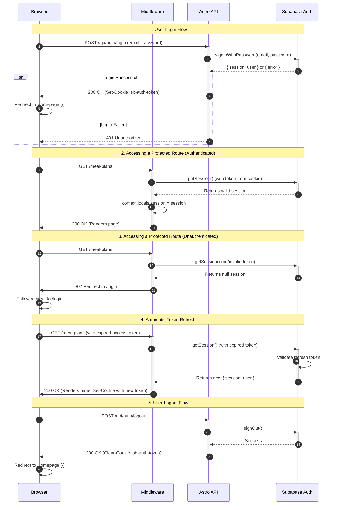

<authentication_analysis>
### 1. Authentication Flows

Based on the project documentation, the primary authentication flows are:
- **User Registration**: New users sign up using an email and password.
- **User Login**: Existing users sign in to access their saved data.
- **User Logout**: Authenticated users sign out, terminating their session.
- **Session Management & Route Protection**: The system manages user sessions on every request, protecting routes that require authentication and refreshing tokens automatically.
- **Password Recovery**: (Implied by a full auth system, though not detailed in the sequence).
- **OAuth Callback Handling**: A dedicated endpoint for handling callbacks from third-party providers or email confirmation links.

### 2. Main Actors and Interactions

- **Browser**: The user's client. It initiates all requests, stores authentication cookies, and handles redirects.
- **Middleware**: An Astro middleware that runs on every server-side request. It is the primary gatekeeper for protected routes. Its main job is to inspect request cookies, validate the session with Supabase, and either grant access or redirect to the login page.
- **Astro API**: A set of serverless functions (API routes) that handle specific authentication tasks like login, registration, and logout. These endpoints communicate directly with Supabase Auth.
- **Supabase Auth**: The external authentication service. It manages user identities, issues and validates tokens (Access and Refresh), and securely stores user credentials.

### 3. Token Verification and Refresh Process

The token management process is handled server-side, leveraging the `@supabase/ssr` library for security and efficiency:
1.  **Initial Request**: The Browser sends a request to the Astro server, including auth tokens stored in cookies.
2.  **Middleware Interception**: The Astro middleware intercepts the request.
3.  **Session Retrieval**: The middleware uses `supabase.auth.getSession()` to retrieve the user session from the cookies. This function automatically communicates with Supabase Auth to validate the Access Token.
4.  **Token Refresh**: If the Access Token is expired but a valid Refresh Token is present, the `getSession()` call will transparently handle the refresh process. It exchanges the Refresh Token for a new Access Token and Refresh Token. The updated tokens are then sent back to the browser as `Set-Cookie` headers in the response.
5.  **Context Population**: If the session is valid, the middleware stores the session and user data in `Astro.locals` for use in protected pages and API endpoints.
6.  **Access Control**: If no valid session can be established, the middleware redirects the user to the login page if they are trying to access a protected route.

### 4. Step-by-Step Authentication Description

- **Login**: The user submits their email and password. The Browser POSTs to the `/api/auth/login` endpoint. The Astro API validates credentials with Supabase Auth. On success, Supabase sets auth cookies, and the API responds. The Browser redirects to a protected page.
- **Registration**: The flow is similar to login, but targets the `/api/auth/register` endpoint and uses Supabase's `signUp` method.
- **Accessing a Protected Page**: The Browser requests a protected URL. The Middleware validates the session from cookies. If valid, the page is rendered. If invalid, the Middleware triggers a redirect to `/login`.
- **Logout**: The user initiates a logout. The Browser POSTs to `/api/auth/logout`. The Astro API calls Supabase's `signOut` method, which invalidates the session and instructs the browser to clear the auth cookies.
</authentication_analysis>

<mermaid_diagram>

</mermaid_diagram>
