<user_journey_analysis>
### 1. User Paths from Reference Files

Based on `prd.md` and `auth-spec.md`, the key user paths related to authentication are:

*   **Registration (`US-001`)**: A new user creates an account using an email and password. On success, they are automatically logged in and redirected to the main application panel.
*   **Login (`US-002`)**: An existing user logs in with their email and password to access their saved data. On success, they are redirected to the main application panel.
*   **Logout**: An authenticated user can log out. The UI should update to show "Login" and "Register" buttons.
*   **Authenticated Access**: A logged-in user can access the core functionalities, like generating and viewing meal plans.
*   **Unauthenticated Access**: A user who is not logged in can access public pages (like the homepage, login, register pages). If they try to access a protected route, they are redirected to the login page.
*   **Email Confirmation Flow (`auth-spec.md`)**: The spec mentions a `/api/auth/callback` endpoint for handling email confirmation, which is a standard part of Supabase's auth flow. After a user signs up, they might need to verify their email before they can log in. The diagram should reflect this.

### 2. Main Journeys and States

1.  **Onboarding Journey**:
    *   `[*] -> HomePage` (Initial state)
    *   `HomePage -> RegistrationPage`
    *   `RegistrationPage -> RegistrationProcess` (sub-state)
        *   `FillForm -> ValidateData -> SubmitForm`
        *   `SubmitForm -> EmailConfirmationPending` (awaiting email verification)
    *   `EmailConfirmationPending -> [User clicks link in email] -> CallbackEndpoint`
    *   `CallbackEndpoint -> LoginProcess` (automatically logs in)
    *   `LoginProcess -> AuthenticatedHomepage`
2.  **Login Journey**:
    *   `HomePage -> LoginPage`
    *   `LoginPage -> LoginProcess` (sub-state)
        *   `FillForm -> ValidateData -> SubmitForm`
    *   `SubmitForm -> AuthenticatedHomepage`
3.  **Authenticated User Journey**:
    *   `AuthenticatedHomepage -> UseAppFeatures` (e.g., Meal Plan Generator)
    *   `UseAppFeatures -> Logout`
    *   `Logout -> HomePage`
4.  **Guest (Unauthenticated) Journey**:
    *   `[*] -> HomePage`
    *   `HomePage -> AccessProtectedFeature`
    *   `AccessProtectedFeature -> RedirectToLogin`

### 3. Decision Points and Alternative Paths

*   **Registration**:
    *   Decision: Is email valid and not in use?
    *   Path 1 (Success): Account created, confirmation email sent.
    *   Path 2 (Failure): Show error message (e.g., "Email already in use").
*   **Login**:
    *   Decision: Are credentials correct?
    *   Path 1 (Success): Session created, user logged in.
    *   Path 2 (Failure): Show error message (e.g., "Invalid credentials").
*   **Access Control (Middleware)**:
    *   Decision: Is user authenticated?
    *   Path 1 (Yes): Allow access to the requested page.
    *   Path 2 (No):
        *   Decision: Is the route protected?
        *   Path 2a (Yes): Redirect to Login page.
        *   Path 2b (No): Allow access to the public page.
*   **Email Verification**:
    *   Decision: Is the verification token valid?
    *   Path 1 (Success): Mark email as confirmed, log the user in.
    *   Path 2 (Failure): Show an error page/message.

### 4. Short Description of States

*   **[*]**: Represents the starting or ending point of the user flow.
*   **HomePage**: The main landing page, accessible to everyone. Content may differ for logged-in vs. guest users.
*   **LoginPage**: The page containing the login form.
*   **RegistrationPage**: The page containing the registration form.
*   **AuthenticatedHomepage**: The main dashboard/view for a logged-in user, likely showing the meal plan generator or history.
*   **LoginProcess**: A composite state representing the actions of logging in (filling form, submitting, backend verification).
*   **RegistrationProcess**: A composite state for the registration flow.
*   **EmailConfirmationPending**: The state after registration submission, where the system waits for the user to verify their email address.
*   **CallbackEndpoint**: The backend endpoint that handles the verification link from the email.
*   **UseAppFeatures**: Represents the user interacting with the core features of the application (e.g., generating plans).
*   **AccessProtectedFeature**: An attempt by a guest user to access a feature that requires login.
*   **RedirectToLogin**: The action of forcing a redirect to the login page.

```mermaid
stateDiagram-v2
    direction LR
    [*] --> Unauthenticated

    state Unauthenticated {
        direction LR
        [*] --> HomePage
        HomePage --> LoginPage: Clicks "Login"
        HomePage --> RegistrationPage: Clicks "Register"
        HomePage --> AccessProtectedContent: Tries to access protected content
        
        AccessProtectedContent --> RedirectToLogin
        note right of AccessProtectedContent
            Middleware checks for session.
            If missing, redirects to Login.
        end note
        RedirectToLogin --> LoginPage

        state "Login Process" as Login {
            [*] --> FillingLoginForm
            FillingLoginForm --> SubmittingLoginForm: Submits form
            SubmittingLoginForm --> CheckingCredentials
            
            state if_credentials_ok <<choice>>
            CheckingCredentials --> if_credentials_ok
            if_credentials_ok --> Authenticated: Credentials OK
            if_credentials_ok --> FillingLoginForm: Invalid Credentials
        }

        state "Registration Process" as Registration {
            [*] --> FillingRegistrationForm
            FillingRegistrationForm --> SubmittingRegistrationForm: Submits form
            SubmittingRegistrationForm --> ValidatingData
            
            state if_data_valid <<choice>>
            ValidatingData --> if_data_valid
            if_data_valid --> CreatingUser: Data OK
            if_data_valid --> FillingRegistrationForm: Invalid Data (e.g., email exists)

            CreatingUser --> EmailConfirmationPending: User created, waits for verification
        }

        LoginPage --> Login
        RegistrationPage --> Registration
    }

    state "Email Verification" as Verification {
        [*] --> UserClicksVerificationLink
        UserClicksVerificationLink --> HandleCallback
        
        state if_token_valid <<choice>>
        HandleCallback --> if_token_valid: API validates token
        if_token_valid --> TokenValid: Token OK
        if_token_valid --> TokenInvalid: Token Invalid or Expired

        TokenInvalid --> [*]
        note right of TokenInvalid
            User is shown an error page and may
            need to request a new verification email.
        end note
    }

    EmailConfirmationPending --> Verification

    state Authenticated {
        direction LR
        [*] --> AuthenticatedHomepage
        AuthenticatedHomepage: User sees main dashboard with their data
        
        AuthenticatedHomepage --> MealPlanGenerator: Interacts with core features
        MealPlanGenerator --> AuthenticatedHomepage
        
        AuthenticatedHomepage --> Logout: Clicks "Logout"
    }

    TokenValid --> Authenticated
    Logout --> Unauthenticated

```

</user_journey_analysis>
<mermaid_diagram>

</mermaid_diagram>
