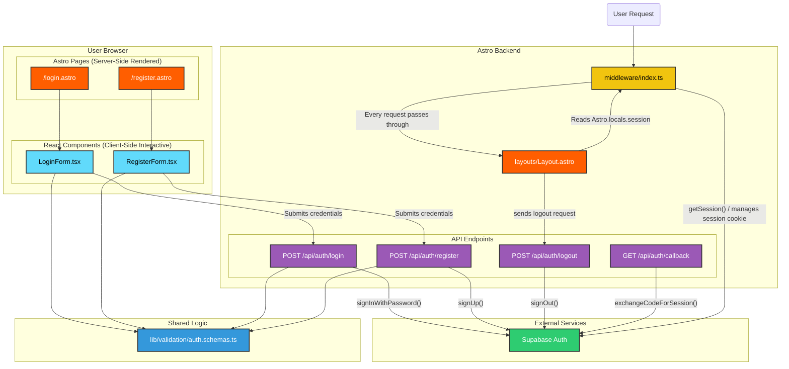

<architecture_analysis>
Based on the project documentation (`prd.md` and `auth-spec.md`), here is the analysis of the authentication module's architecture.

### 1. Component inventory from referenced files:

- **Layouts:** `src/layouts/Layout.astro`
- **Astro Pages:** `src/pages/login.astro`, `src/pages/register.astro`
- **React Components:** `src/components/auth/LoginForm.tsx`, `src/components/auth/RegisterForm.tsx`
- **API Endpoints:** `POST /api/auth/register`, `POST /api/auth/login`, `POST /api/auth/logout`, `GET /api/auth/callback`
- **Middleware:** `src/middleware/index.ts`
- **Validation:** `src/lib/validation/auth.schemas.ts`
- **External Service:** Supabase Auth

### 2. Main pages and their corresponding components:

- `src/pages/login.astro`: This page will host the `LoginForm.tsx` component. It's the entry point for existing users to sign in.
- `src/pages/register.astro`: This page will host the `RegisterForm.tsx` component, allowing new users to create an account.

### 3. Data flow between components:

- The user interacts with the React form components (`LoginForm.tsx`, `RegisterForm.tsx`).
- Upon submission, these components send `POST` requests with user credentials to the corresponding API endpoints (`/api/auth/login`, `/api/auth/register`).
- The API endpoints validate the incoming data using shared Zod schemas from `auth.schemas.ts`.
- The endpoints then communicate with Supabase Auth to perform the actual authentication (`signUp`, `signInWithPassword`).
- Astro Middleware (`middleware/index.ts`) intercepts every request to manage the user session. It communicates with Supabase to get the current session state and stores it in `Astro.locals`.
- The main layout (`Layout.astro`) reads the session state from `Astro.locals` to conditionally render UI elements like "Login/Register" or "Logout" buttons.

### 4. Brief description of each component's functionality:

- **`login.astro` / `register.astro`**: Server-side rendered pages that provide the HTML shell for the authentication forms. They will redirect already authenticated users.
- **`LoginForm.tsx` / `RegisterForm.tsx`**: Client-side interactive React components that manage form state, perform client-side validation, and handle API communication for login and registration.
- **API Endpoints (`/api/auth/*`)**: Backend handlers that receive requests from the frontend, validate data, and use the Supabase JS library to execute authentication logic (login, register, logout). They are responsible for handling cookies for session management.
- **`middleware/index.ts`**: A crucial server-side component that runs on every request. It checks for a valid session cookie, retrieves session information from Supabase, and makes it available globally to other server-side components via `Astro.locals`. It also protects routes by redirecting unauthenticated users.
- **`Layout.astro`**: The main site layout. It adapts the UI based on whether a user is logged in, using the session data provided by the middleware.
- **`auth.schemas.ts`**: A shared module defining data validation rules (using Zod) for authentication forms, ensuring consistency between client and server.
  </architecture_analysis>

<mermaid_diagram>

</mermaid_diagram>
